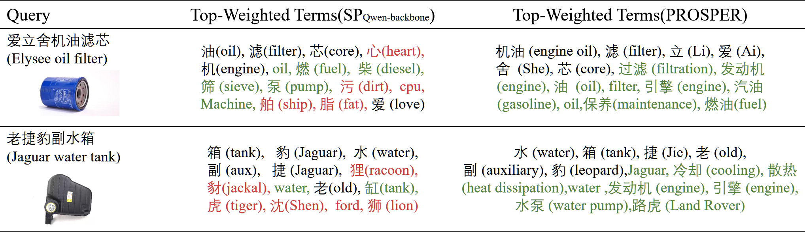
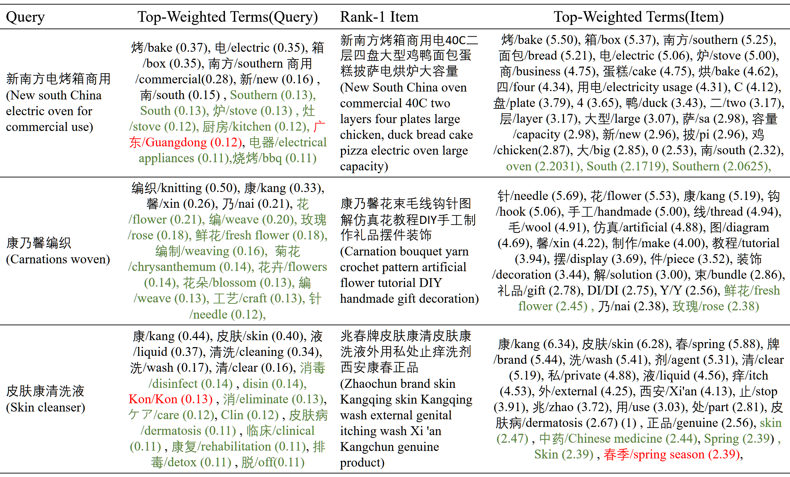

## **PROSPER: a framework for PROduct search using LLMs as SParsE Retrievers**

## 1. Overview

This repository contains the code accompanying the paper:

> **“LLMs as Sparse Retrievers: A Framework for First-Stage Product Search”**

PROSPER is a practical framework that leverages large language models (LLMs) as **sparse retrievers** for first-stage product search. 

The code in this repository is a **review version** : all production-specific dataflows, pipelines, and serving infrastructure have been removed or abstracted away to protect privacy.

### Repository structure

At a high level, the repository is organized as follows:

- **`main.py`**  
  Entry point for training and inference. It wires together configuration, model construction, data loading, loss definition, and training/evaluation loops.  
  - `mode=train`: launches distributed training.  
  - `mode=infer`: runs distributed inference and exports sparse representations.

- **`conf/config.yaml`**  
  A reference configuration file that defines model hyperparameters, training schedule, regularization (e.g., FLOPS regularizer), and test-time settings. This file is meant as a **template**; real production configs in our system contain additional internal fields that are not included here.

- **`model/`**  
  Core modeling and training components:
  - `transformer_rep.py`: backbone representation model, including the `SiameseBase` architecture and its instantiations (e.g., Qwen-based causal LM). It handles term expansion, aggregation, and sparse representation construction.
  - `transformer_trainer.py`: training loop for the transformer-based sparse retriever, including mixed-precision support, FLOPS/L0 regularization, and checkpoint saving.
  - `transformer_tester.py`: inference-time logic for producing and exporting sparse representations of queries or items.
  - `trainer.py`: base trainer abstraction and iteration-based trainer.
  - `dataloader.py`: data loader wrappers for query–document pairs and text collections, handling tokenization and batch collation (including optional BM25 supervision and hard negatives).
  - `utils_train.py`: utilities for building models, losses, optimizers/schedulers, and initializing distributed training.
  - `utils.py`: lightweight helpers (e.g., directory creation, simple dict parsing).

- **`model/tool/`**  
  Auxiliary tools used by the framework:
  - `amp.py`: a simple mixed-precision manager wrapper.
  - `losses.py`: loss functions, notably in-batch pairwise NLL for contrastive training, with optional hard negatives.
  - `regularization.py`: sparsity-oriented regularizers (e.g., L0 and FLOPS) and their schedulers.
  - `loader.py`: helpers for resolving model paths or Hub IDs (download handled by `transformers`).
  - `utils.py`: utilities for saving checkpoints and related artifacts.

## 2. Case study

In this section, we present both offline and online case studies to demonstrate the effectiveness of PROSPER in real world scenarios. The offline case study analyzes the term expansion and weighting optimization results, while the online case study examines the exclusive recall results found in the multi-channel retrieval system in Taobao search.

### 2.1 Offline case study

To provide concrete insights into how PROSPER optimizes term expansion and weighting, we present detailed case studies showcasing the optimization results for the two examples mentioned in the preliminary section. The following figure demonstrates the before-and-after term expansion and weighting patterns for "爱立舍机油滤芯" (Elysee oil filter) and "老捷豹副水箱" (Old Jaguar water tank). The Figure 1 illustrates how PROSPER effectively reduces lexical expansion hallucination while maintaining useful semantic expansions, leading to more focused and relevant term representations.

**Figure 1: Case study of term expansion and weighting optimization by SP_Qwen-backbone and PROSPER**

*The table shows the top-weighted terms before and after optimization for two representative product search queries. Terms are ranked by weight in descending order. Literal terms are shown in black, useful expansions in green, and noisy expansions in red.*

In addition, the following Figure 2 also shows more offline cases.

**Figure 2: More offline query and item cases of PROSPER**

*The table shows each term and its English translation, with weights in parentheses. Terms are ranked by weight in descending order. Literal terms are shown in black, useful expansions in green, and noisy expansions in red.*

### 2.2 Online case study

Our online case analysis focuses on products exclusively recalled by PROSPER, highlighting its unique contribution to the overall search performance. In this system, each retrieval channel is assigned a unique identifier, and PROSPER is designated as the eighth channel (with index 7). The retrieval source for each product is tracked using a bitmask called "recall_types". A "recall_types" value of 2^7=128 indicates that the product was recalled solely by PROSPER. The relevance of recalled items is assessed by a Taobao internal query-item relevance model, which assigns a "rnr" score: 2 for highly relevant, 1 for relevant, and 0 for irrelevant. As shown in the following figure, both "recall_types" and "rnr" are annotated within the green box below each product in the table. In practice, for each user query, there are multiple exclusive recall results by PROSPER as well as numerous multi-channel recall results. For convenience, in the table, we present one exclusive recall result by PROSPER and two recall results from other channels for each example query.

**Figure 3: Online case study of exclusive product recalls by PROSPER in Taobao's hybrid retrieval system**

*The left column shows products exclusively recalled by PROSPER ("recall_types" = 128), while the right column shows products for the same queries recalled by other channels. The "rnr" score indicates the relevance level.*

As illustrated by the cases in the Figure 3 above, even for common queries where other channels already demonstrate strong recall performance, they can still fail to retrieve some relevant products. PROSPER effectively addresses this gap by recalling these missing items. This ensures that the initial retrieval stage more comprehensively meets user needs, thereby enhancing the performance of the Taobao search engine and contributing to incremental online revenue for the platform.

## 3. Necessary Statement

The **full production deployment** of PROSPER is deeply integrated with internal data pipelines, logging systems, and serving infrastructure. These components necessarily operate on **proprietary user and item data** and interact with internal services that cannot be exposed.

This repository is provided **solely for the purpose of peer review**. 
After the paper is accepted, we will release an **expanded open-source version** that reconstructs a complete, end-to-end dataflow based on **publicly available datasets and open-source tooling**, without any dependency on proprietary infrastructure.  

